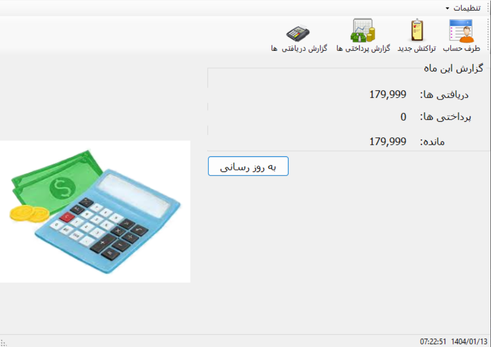
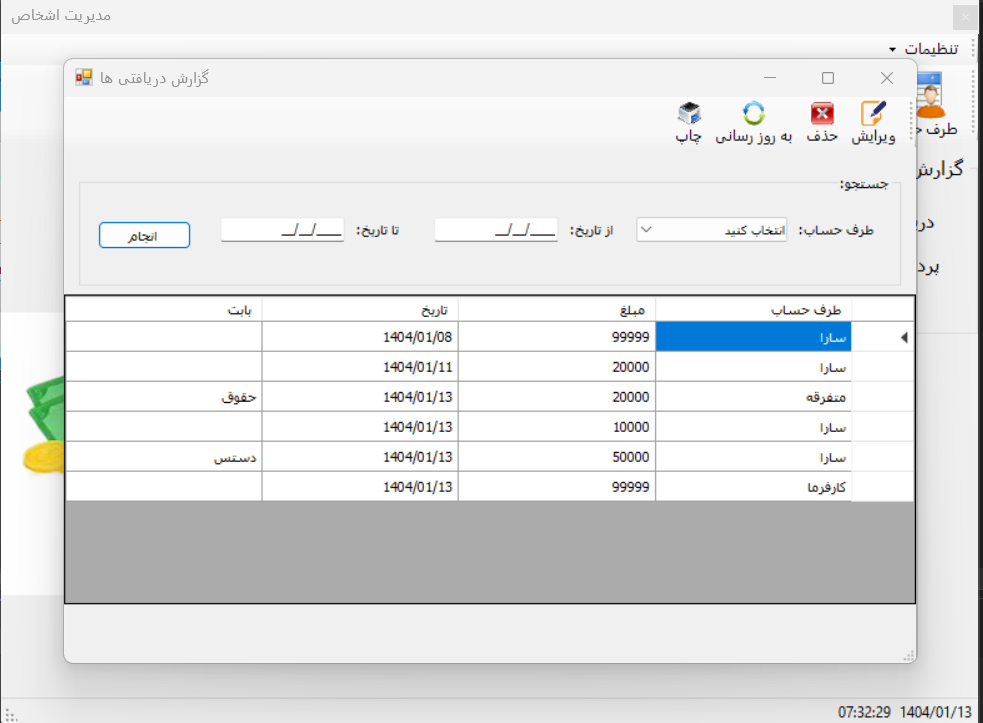
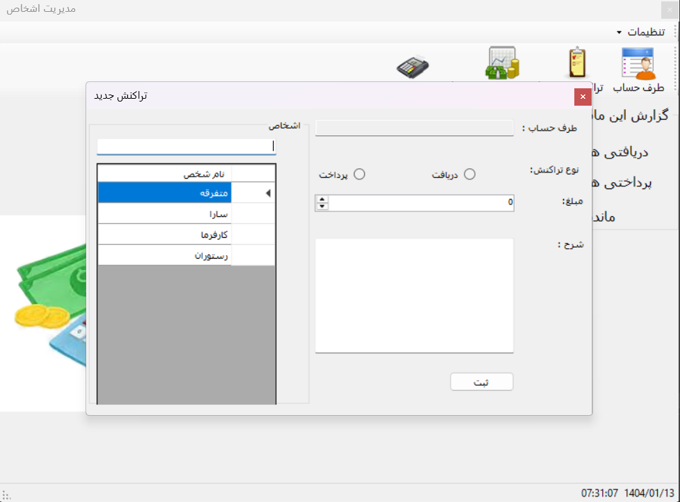

# Personal Accounting Manager

## Overview

Personal Finance Manager is a Windows Forms application designed to help users track their income and expenses efficiently. The main dashboard provides an overview of the user's financial summary for the current month, including total income, total expenses, and the balance between them.

## Features

- **Dashboard Overview:** Displays the current month's income, expenses, and balance.

- **Account Management:**  
  - Add, edit, or delete financial accounts.

- **Transaction Management:**  
  - Navigate to the transaction form to add, edit, or delete income and expense transactions.

- **Detailed Reports:**  
  - View detailed income and expense reports.
  - Filter transactions based on date, account name, or transaction type.
  - Generate and export reports in PDF and Excel formats.

## Screenshots

### Main Page

This is the main page of the application that displays the current month's financial summary.

### Reports

View detailed income and expense reports. You can filter transactions by date, account name, or transaction type and generate reports in PDF and Excel formats.

### Transaction Management

This is the transaction form where users can add, edit, or delete income and expense transactions.

## Technologies Used

- C#
- Windows Forms
- SQL Database
- Git/GitHub

